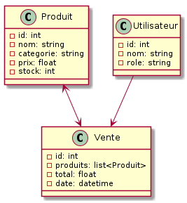

# Diagramme de Classes

## Description
Ce diagramme représente les entités principales du système :
- **Produit** : Identifiant, nom, catégorie, prix, stock.
- **Vente** : Identifiant, liste de produits, total, date.
- **Utilisateur** : Identifiant, nom, rôle.

## Diagramme
```
[Produit] <--> [Vente]
[Utilisateur] --> [Vente]
```

## Image du Diagramme de Classes


