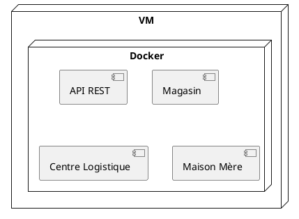

# Diagramme UML – Vue déploiement

Ce diagramme montre le déploiement des modules sur la VM et les conteneurs Docker.

```plantuml
@startuml
node "VM" {
  node "Docker" {
    component "API REST"
    component "Magasin"
    component "Centre Logistique"
    component "Maison Mère"
  }
}
@enduml
```
