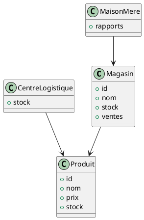

# Diagramme UML – Vue implémentation

Ce diagramme montre la structure des classes principales du système.

```plantuml
@startuml
class Magasin {
  +id
  +nom
  +stock
  +ventes
}
class CentreLogistique {
  +stock
}
class MaisonMere {
  +rapports
}
class Produit {
  +id
  +nom
  +prix
  +stock
}
Magasin --> Produit
CentreLogistique --> Produit
MaisonMere --> Magasin
@enduml
```
