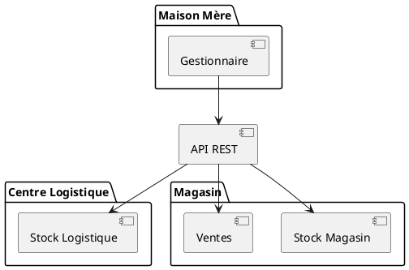

# Diagramme UML – Vue logique

Ce diagramme présente les modules principaux :
- Magasin
- Centre logistique
- Maison mère
- API REST

```plantuml
@startuml
package "Maison Mère" {
  [Gestionnaire]
}
package "Centre Logistique" {
  [Stock Logistique]
}
package "Magasin" {
  [Stock Magasin]
  [Ventes]
}
[Gestionnaire] --> [API REST]
[API REST] --> [Stock Logistique]
[API REST] --> [Stock Magasin]
[API REST] --> [Ventes]
@enduml
```
