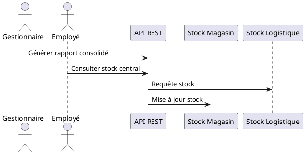

# Diagramme UML – Vue processus

Ce diagramme illustre les interactions entre les modules via des événements et API REST.

```plantuml
@startuml
actor Gestionnaire
actor Employé
participant "API REST" as API
participant "Stock Magasin"
participant "Stock Logistique"
Gestionnaire -> API : Générer rapport consolidé
Employé -> API : Consulter stock central
API -> "Stock Logistique" : Requête stock
API -> "Stock Magasin" : Mise à jour stock
@enduml
```
