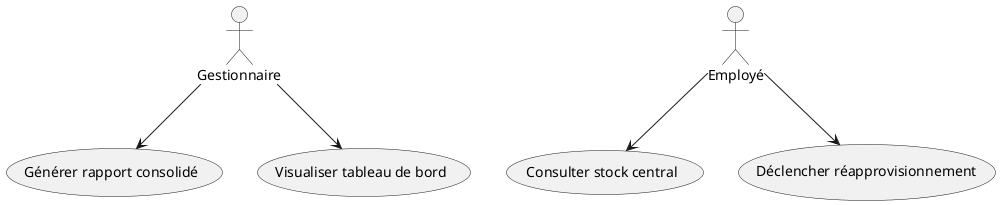

# Diagramme UML – Vue cas d’utilisation

Ce diagramme présente les principaux cas d’utilisation du système.

```plantuml
@startuml
actor Gestionnaire
actor Employé
Gestionnaire --> (Générer rapport consolidé)
Gestionnaire --> (Visualiser tableau de bord)
Employé --> (Consulter stock central)
Employé --> (Déclencher réapprovisionnement)
@enduml
```
