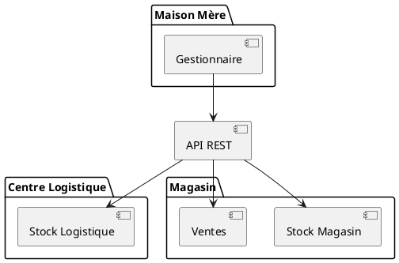
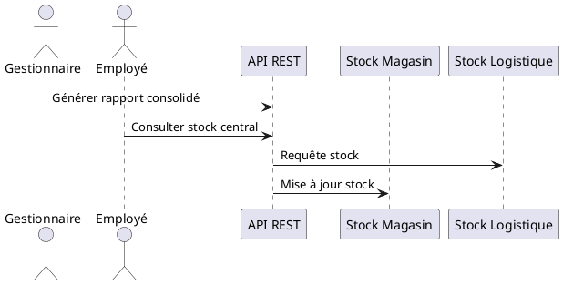
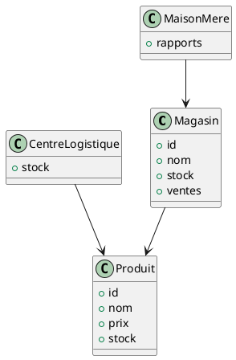
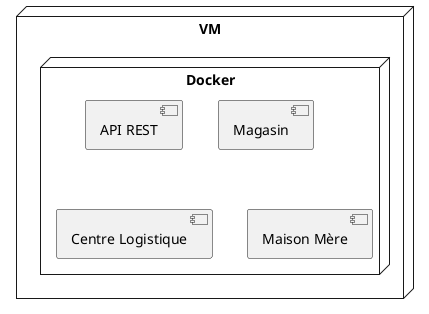
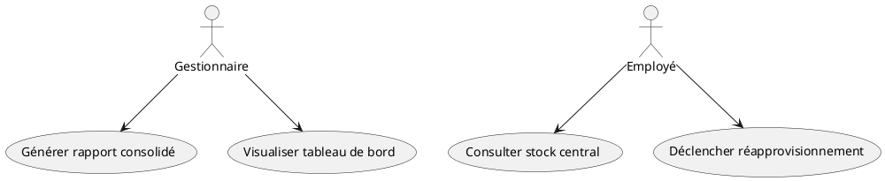

# Rapport complet – Laboratoire 2 (Arc42)

## Cours : LOG430 – Architecture Logicielle

Session : Été 2025
Étudiant : Simon Tremblay

---

## 1. Introduction et contexte

Le Laboratoire 2 s'inscrit dans la continuité des travaux réalisés lors des Labs 0 et 1. Après avoir mis en place une application minimale, la persistance des données, la conteneurisation et l'intégration continue, l'objectif de ce laboratoire est d'étendre l'architecture pour supporter la gestion simultanée de plusieurs magasins, tout en assurant la cohérence et la synchronisation des données à l'échelle de l'entreprise.

L'entreprise doit désormais gérer plusieurs magasins, un centre logistique et une maison mère. Les exigences évoluent vers une architecture plus modulaire, évolutive et observable, capable de répondre aux besoins de supervision, de consolidation des rapports et d'intégration future d'interfaces web ou mobiles.

---

## 2. Analyse des besoins et continuité

Les éléments fondamentaux mis en place lors des premiers laboratoires sont conservés :

- Structure du dépôt Git, CI/CD avec GitHub Actions, conteneurisation Docker, tests unitaires, documentation technique et ADR.

Cependant, l'architecture doit évoluer pour :

- Permettre la gestion de plusieurs magasins et d'un centre logistique,
- Assurer la synchronisation fiable des stocks et transactions,
- Offrir une supervision centralisée via la maison mère,
- Garantir la cohérence et la traçabilité des opérations.

Les défis majeurs résident dans la cohérence des données, la scalabilité, la modularité et l'observabilité du système. Les sous-domaines DDD identifiés sont : ventes en magasin, gestion logistique et supervision maison mère.

---

## 3. Exigences fonctionnelles (MoSCoW)

- **Must have** : Rapport consolidé des ventes, consultation du stock central, tableau de bord, synchronisation des données.
- **Should have** : Mise à jour des produits, approvisionnement magasin.
- **Could have** : Alertes automatiques, interface web minimale.

---

## 4. Décisions d'architecture (ADR)

### ADR 1 : Architecture multi-magasins

**Contexte** : L’entreprise doit gérer plusieurs magasins, un centre logistique et une maison mère. La solution doit permettre la synchronisation des stocks et des transactions entre tous les points.

**Décision** : Adoption d’une architecture orientée services (SOA) avec une base centrale et des modules pour chaque magasin, le centre logistique et la maison mère. Chaque module communique via des API REST.

**Conséquences** :

- Scalabilité accrue pour ajouter de nouveaux magasins.
- Synchronisation facilitée des données.
- Possibilité d’évolution vers une interface web ou mobile.

### ADR 2 : Synchronisation et cohérence des données

**Contexte** : La cohérence des stocks et des transactions entre magasins et maison mère est critique.

**Décision** : Utilisation d’un système de synchronisation basé sur des événements (Event Sourcing) pour garantir la cohérence et la traçabilité des opérations. Les mises à jour sont propagées via des messages asynchrones.

**Conséquences** :

- Fiabilité accrue de la synchronisation.
- Historique complet des opérations.
- Facilité d’intégration de nouveaux modules (magasins, logistique).

---

## 5. Architecture proposée et diagrammes UML

L’architecture cible repose sur une approche orientée services, chaque module (magasin, centre logistique, maison mère) étant isolé et communiquant via des API REST et des événements asynchrones. Les diagrammes suivants illustrent les différentes vues du système selon l’approche 4+1 :

### 5.1 Vue logique

Ce diagramme présente les modules principaux et leurs interactions :



### 5.2 Vue processus

Ce diagramme illustre les interactions entre les modules via des événements et API REST :



### 5.3 Vue implémentation

Ce diagramme montre la structure des classes principales du système :



### 5.4 Vue déploiement

Ce diagramme montre le déploiement des modules sur la VM et les conteneurs Docker :



### 5.5 Vue cas d’utilisation

Ce diagramme présente les principaux cas d’utilisation du système :



---

## 6. Technologies et outils

Le projet s’appuie sur les technologies suivantes :

- Python, SQLAlchemy, Docker, Docker Compose, Grafana, API REST, Event Sourcing.

---

## 7. CI/CD et observabilité

L’intégration continue est assurée par un pipeline GitHub Actions, qui exécute les tests, construit les images Docker et déploie les services. L’observabilité est assurée par Grafana, accessible sur [http://localhost:3000](http://localhost:3000) avec les identifiants par défaut (admin/admin).

---

## 8. Structure du projet et instructions d’exécution

Pour exécuter le projet :

1. Cloner le dépôt :
   ```bash
   git clone https://github.com/EnzoTremblay/log430.git
   ```
2. Se placer dans le dossier du projet :
   ```bash
   cd log430
   ```
3. Lancer les services avec Docker Compose :
   ```bash
   docker-compose up --build
   ```
4. Accéder au tableau de bord Grafana : [http://localhost:3000](http://localhost:3000)

---

## 9. Liens et livrables

- Dépôt GitHub : https://github.com/EnzoTremblay/log430
- Fichier .zip contenant le code source des Labs 0, 1 et 2.

---

*Document généré avec l’aide de ChatGPT pour la rédaction narrative, la structuration et l’intégration des diagrammes UML.*
