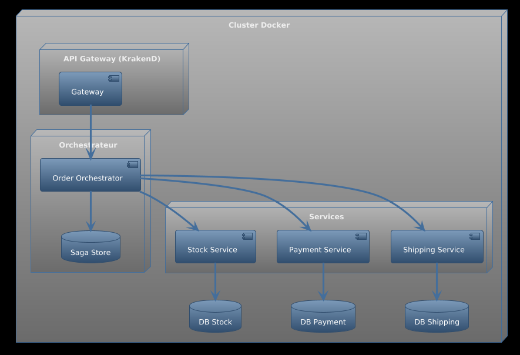
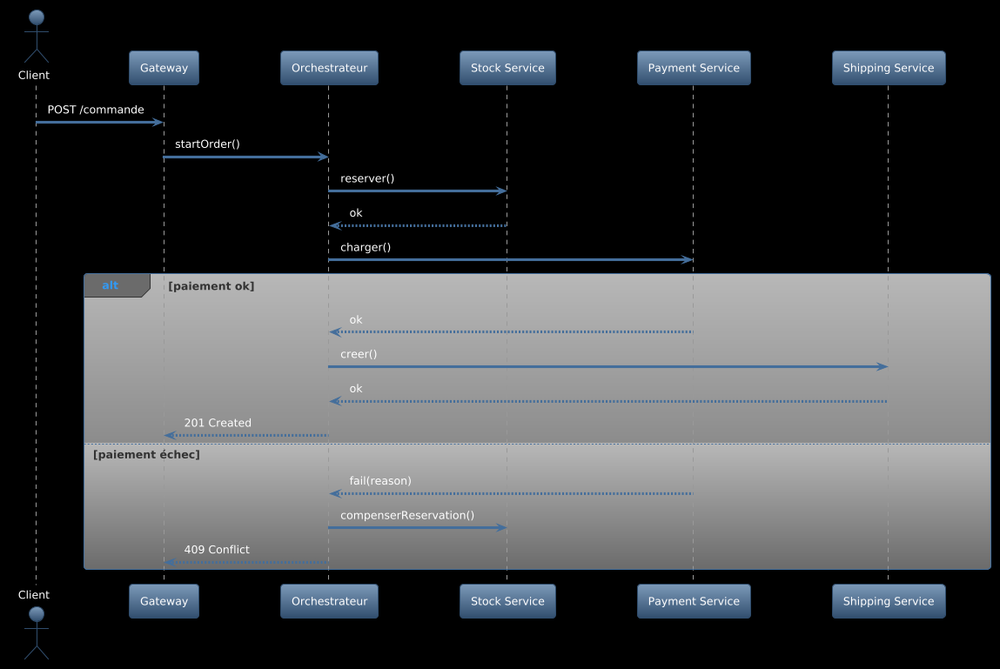
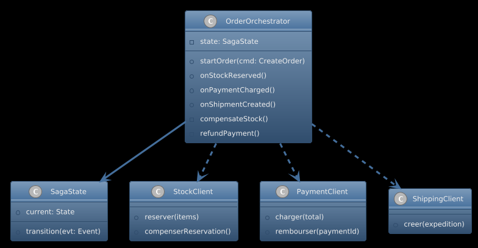
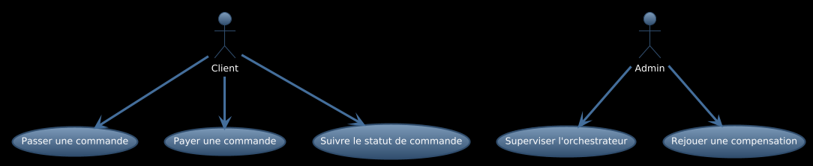

# Rapport complet – Laboratoire 6 : Proposition de saga orchestrée et machine d’état

## 1. Contexte et objectifs

Je propose l’introduction d’une saga orchestrée pour le processus de commande (réservation de stock, paiement, expédition) afin d’assurer cohérence et compensations.

## 2. Décisions d’architecture (ADR)

- ADR 1 : Orchestration centralisée – un orchestrateur pilote le flux et déclenche les compensations.
- ADR 2 : Machine d’état – modéliser explicitement états, transitions, gardes et actions.

### ADR 1 – Orchestration centralisée de la saga de commande

#### TITLE
Orchestration centralisée de la saga de commande

#### STATUS
Proposed

#### CONTEXT
Le processus « commande » traverse plusieurs services (Stock, Paiement, Expédition) qui peuvent échouer de façon indépendante. Nous devons garantir la cohérence de bout en bout, déclencher des compensations en cas d’échec partiel, rendre le flux observable (traces, métriques), et limiter le couplage direct entre services. L’absence d’un contrôle explicite complique le raisonnement sur les échecs et la conformité.

#### DECISION
Introduire un service d’orchestration dédié qui pilote la progression de la saga (réserver stock → charger paiement → créer expédition), évalue les conditions de réussite/échec et déclenche les actions de compensation documentées. L’orchestrateur persiste l’état d’avancement et journalise chaque transition. Les interactions avec les services métiers passent par des interfaces claires (API/contrats), afin de conserver un couplage faible et la possibilité de tests isolés.

#### CONSEQUENCES
Avantages
- Visibilité centralisée du flux métier et des transitions.
- Gestion déterministe des erreurs et des compensations.
- Point unique pour appliquer règles de conformité et observabilité.

Inconvénients / risques
- Point de dépendance supplémentaire (disponibilité/HA requises).
- Risque de couplage à l’orchestrateur s’il n’y a pas de contrats explicites.
- Complexité de persistance d’état et de reprise sur incident.

#### COMPLIANCE
- Contrats d’API versionnés entre Orchestrateur et services (Stock/Paiement/Expédition).
- Modèle d’état et scénarios de compensation formalisés et conservés sous contrôle de version (voir UML).
- Tests automatisés couvrant les chemins heureux et d’échec/compensation.
- Journalisation structurée des transitions + métriques (taux de succès, temps de compensation).
- Revue d’architecture obligatoire pour tout changement impactant le flux.

#### NOTES
- Auteur: Équipe LOG430
- Date: 2025-08-16
- Liens: 
	- Séquence: UML/sequence_saga_orchestrateur.puml
	- Déploiement: UML/deployment_orchestrateur.puml
	- Classes: UML/classes_saga_orchestrateur.puml
	- Cas d’utilisation: UML/usecase_orchestrateur.puml
	- Rapport: rapport_complet_lab6.md

### ADR 2 – Machine d’état explicite pour la saga

#### TITLE
Machine d’état explicite pour la saga

#### STATUS
Proposed

#### CONTEXT
La saga suit un enchaînement d’états (INIT → RESERVE_STOCK → CHARGE_PAYMENT → CREATE_SHIPMENT → DONE) ponctué de conditions et d’échecs potentiels, nécessitant des transitions de compensation (ex.: release stock, refund). Un modèle implicite rend le comportement difficile à auditer et à tester.

#### DECISION
Modéliser la saga à l’aide d’une machine d’état explicite (états, événements, gardes, actions). Les transitions sont persistées et journalisées. Le modèle d’état devient artefact contractuel et sert d’entrée aux tests automatisés. Les compensations sont des transitions dédiées et auditées.

#### CONSEQUENCES
Avantages
- Comportement explicite, traçable et testable.
- Chemins d’échec/compensation gérés de façon systématique.
- Support naturel pour la reprise après incident (re-hydratation d’état).

Inconvénients / risques
- Courbe d’apprentissage et surcoût de modélisation.
- Risque de divergence entre modèle et implémentation si la gouvernance est faible.

#### COMPLIANCE
- Diagrammes d’état et séquence versionnés (voir UML).
- Tests unitaires et scénarios d’intégration couvrant transitions heureuses et d’échec.
- Règles de nommage et de version des états/événements.
- Observabilité: logs structurés par transition et corrélation par ID de saga.

#### NOTES
- Auteur: Équipe LOG430
- Date: 2025-08-16
- Liens:
	- Séquence: UML/sequence_saga_orchestrateur.puml
	- Classes: UML/classes_saga_orchestrateur.puml
	- Rapport: rapport_complet_lab6.md

## 3. Conception (UML 4+1)

- Vue Processus : étapes RESERVE_STOCK → CHARGE_PAYMENT → CREATE_SHIPMENT avec chemins d’échec.
- Vue Implémentation (conceptuelle) : l’orchestrateur encapsule le contrôle; services externes réels restent découplés.

### 3.1 Déploiement

Voir `Docs/UML/deployment_orchestrateur.puml`.

### 3.2 Séquence

Voir `Docs/UML/sequence_saga_orchestrateur.puml`.

### 3.3 Classes

Voir `Docs/UML/classes_saga_orchestrateur.puml`.

### 3.4 Cas d’utilisation

Voir `Docs/UML/usecase_orchestrateur.puml`.

## 4. Impacts et plan d’adoption

- Introduire un orchestrateur (service dédié) et définir les interfaces avec Stock/Paiement/Expédition.
- Formaliser la machine d’état (états/transitions), journaliser chaque transition.
- Prévoir des actions de compensation documentées et testables.
- Étapes: (1) définir contrat API, (2) créer orchestrateur minimal, (3) brancher services, (4) tests d’échec/compensation, (5) observabilité.

---

Document narratif de proposition (aucune implémentation logicielle dans ce lab).
