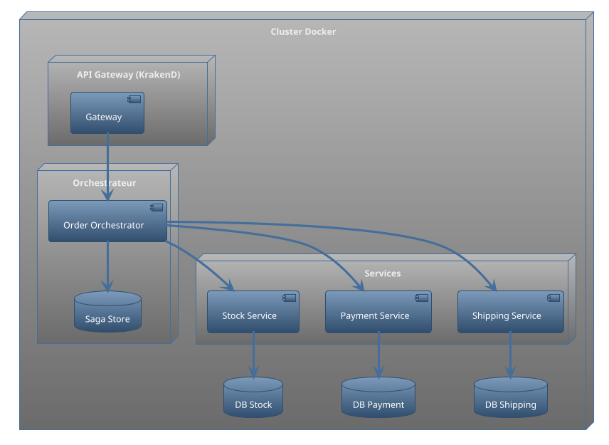
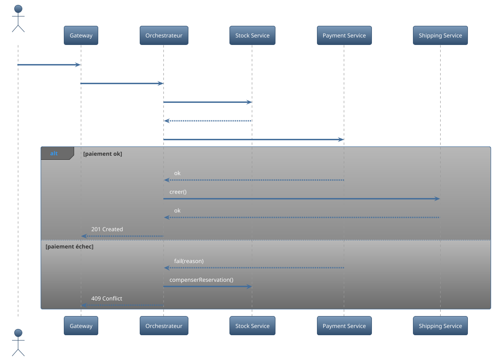
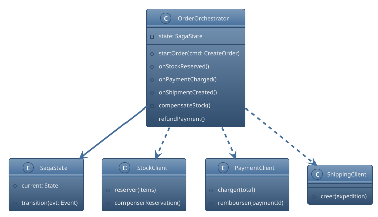
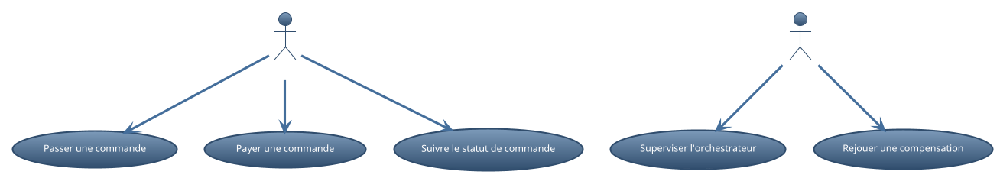

# Rapport complet – Laboratoire 6 : Proposition de saga orchestrée et machine d’état

## 1. Contexte et objectifs
Je propose l’introduction d’une saga orchestrée pour le processus de commande (réservation de stock, paiement, expédition) afin d’assurer cohérence et compensations.

## 2. Décisions d’architecture (ADR)
- ADR 1 : Orchestration centralisée – un orchestrateur pilote le flux et déclenche les compensations.
- ADR 2 : Machine d’état – modéliser explicitement états, transitions, gardes et actions.

## 3. Conception (UML 4+1)
- Vue Processus : étapes RESERVE_STOCK → CHARGE_PAYMENT → CREATE_SHIPMENT avec chemins d’échec.
- Vue Implémentation (conceptuelle) : l’orchestrateur encapsule le contrôle; services externes réels restent découplés.

### 3.1 Déploiement
Voir `Docs/UML/deployment_orchestrateur.puml`.

### 3.2 Séquence
Voir `Docs/UML/sequence_saga_orchestrateur.puml`.

### 3.3 Classes
Voir `Docs/UML/classes_saga_orchestrateur.puml`.

### 3.4 Cas d’utilisation
Voir `Docs/UML/usecase_orchestrateur.puml`.

## 4. Impacts et plan d’adoption
- Introduire un orchestrateur (service dédié) et définir les interfaces avec Stock/Paiement/Expédition.
- Formaliser la machine d’état (états/transitions), journaliser chaque transition.
- Prévoir des actions de compensation documentées et testables.
- Étapes: (1) définir contrat API, (2) créer orchestrateur minimal, (3) brancher services, (4) tests d’échec/compensation, (5) observabilité.

---

Document narratif de proposition (aucune implémentation logicielle dans ce lab).
