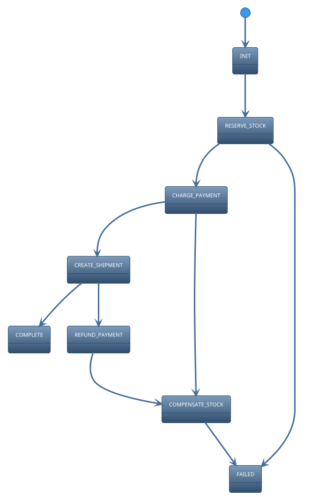
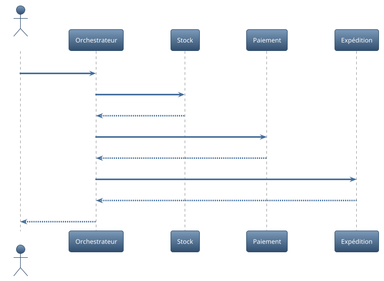

# Rapport complet – Laboratoire 6 : Saga orchestrée et machine d’état

## 1. Contexte et objectifs
Dans ce laboratoire, j’implémente une saga orchestrée pour le processus de commande impliquant la réservation de stock, le paiement et l’expédition. L’objectif est de garantir la cohérence des opérations en présence d’échecs et de gérer les compensations.

## 2. Architecture et décisions (ADR)
- ADR 1 : Orchestration centralisée de la saga – un orchestrateur pilote le flux et déclenche les compensations.
- ADR 2 : Machine d’état – utilisation de `transitions` pour modéliser états, gardes, et actions.

## 3. Conception (UML 4+1)
- Vue Processus : La saga suit les étapes RESERVE_STOCK -> CHARGE_PAYMENT -> CREATE_SHIPMENT avec chemins d’échec.
- Vue Logique : L’orchestrateur encapsule la logique de contrôle, les services externes sont abstraits.
- Vue Implémentation : `OrderSaga` modèle la machine d’état (voir diagrammes UML).

Diagramme d’état de la saga:

Diagramme de séquence (succès):

## 4. Implémentation
`OrderSaga` utilise la librairie `transitions` et expose `run()` pour orchestrer la progression. Des flags permettent de simuler les issues pour les tests.

## 5. Tests
Trois tests valident :
- le chemin de succès (état final COMPLETE),
- l’échec au paiement avec compensation (état final FAILED),
- l’échec à l’expédition avec remboursement + compensation (état final FAILED).

## 6. Exécution
- Installer dépendances et exécuter `pytest lab/lab6/tests -q`.

## 7. Limites et perspectives
- Simulation des services externes par flags; un test d’intégration avec mocks serait un plus.
- Persistance de la saga non implémentée; une outbox/event store pourrait être ajoutée.

---

Document rédigé avec l’aide de GitHub Copilot.
