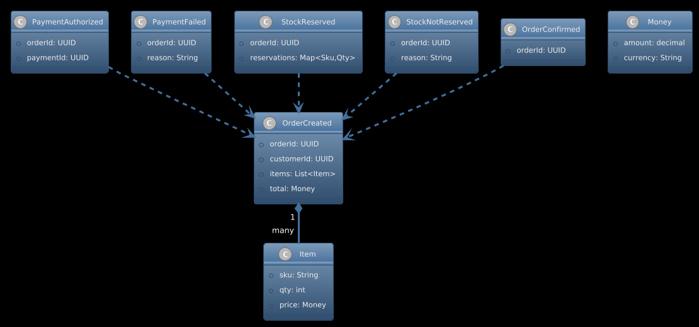
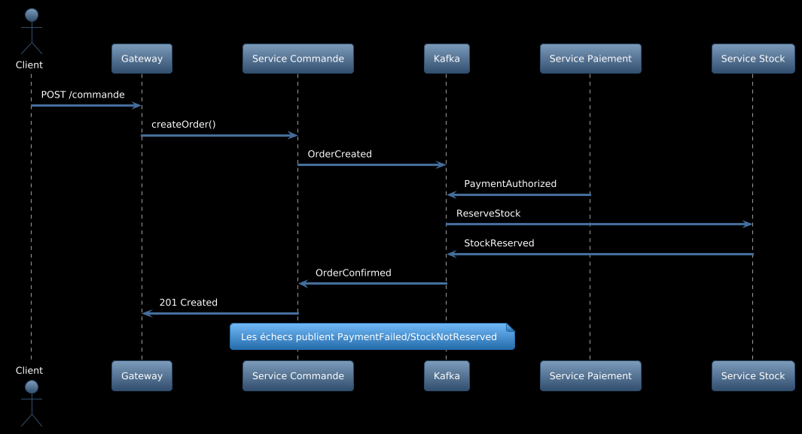
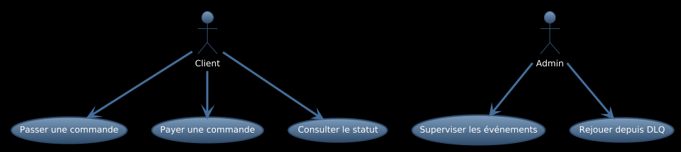

# Rapport complet – Lab 7 : Proposition d’architecture événementielle

## 1. Contexte et objectifs

Je propose l’évolution du système (Lab 5/6) vers une architecture événementielle. L’objectif est de découpler les services, fiabiliser les échanges et permettre une meilleure scalabilité.

## 2. Changements proposés

- Introduction d’un bus d’événements (Kafka/Redpanda) et d’un Schema Registry.
- Passage d’une saga orchestrée (Lab 6) à une saga chorégraphiée par événements.
- Adoption du pattern Outbox dans chaque service pour la publication fiable.
- Idempotence côté consommateurs et mise en place d’une DLQ.
- Versionnement des sujets (topics) et gouvernance des schémas.
- Traces distribuées (OpenTelemetry) pour corréler les événements.
- Ajustement des services existants pour publier/consommer des Domain Events (OrderCreated, PaymentAuthorized, StockReserved, etc.).

## 3. Impacts sur l’existant

- Services Commande, Paiement, Stock deviennent producteurs/consommateurs.
- Les intégrations REST via Gateway restent pour les frontaux; la logique inter-services migre vers événements.
- Les tests d’intégration nécessitent un broker local (docker-compose pour Kafka/Redpanda) et des tests d’idempotence.
- Observabilité enrichie (metrics + traces d’événements).

## 4. Diagrammes (UML 4+1)

### 4.1 Déploiement

Voir `Docs/UML/deployment_evenementiel.puml`.

### 4.2 Séquence (commande par événements)

Voir `Docs/UML/sequence_commande_evenements.puml`.

### 4.3 Classes (Domain Events)

Voir `Docs/UML/classes_domain_events.puml`.

### 4.4 Cas d’utilisation

Voir `Docs/UML/usecase_evenementiel.puml`.

## 5. Plan d’adoption

- Étape 1: Ajouter Kafka/Redpanda + Schema Registry via docker-compose.
- Étape 2: Implémenter Outbox dans Service Commande, publier OrderCreated.
- Étape 3: Adapter Paiement et Stock comme consommateurs/producteurs.
- Étape 4: Ajouter idempotence et DLQ; inclure tests d’intégration.
- Étape 5: Activer traces distribuées (OpenTelemetry) et dashboards.

---

Document rédigé avec l’aide de GitHub Copilot.
