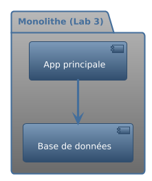
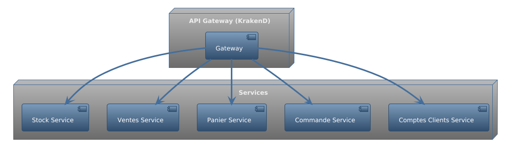
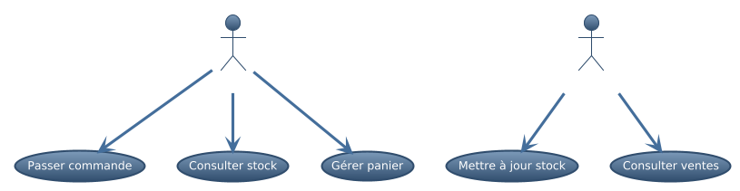
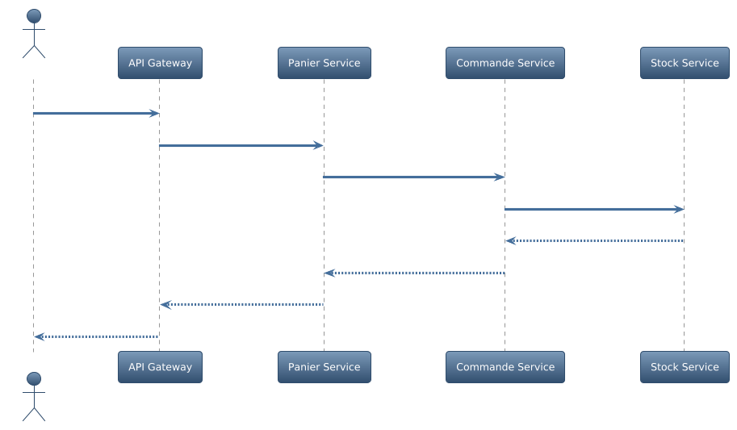

# Script de présentation – Étape 2

## 1. Titre & Introduction
Bonjour à tous, je vais vous présenter l’évolution de mon système logiciel du Lab 3 au Lab 5, en mettant l’accent sur les choix architecturaux et leurs impacts.

## 2. Architecture initiale (Lab 3)
Au départ, mon système était un monolithe (voir schéma ci-dessous). Toutes les fonctionnalités étaient regroupées dans une seule application connectée à une base de données unique. Cette approche a montré ses limites en termes de scalabilité et de maintenance.

## 3. Architecture finale (Lab 5)
J’ai migré vers une architecture microservices, chaque domaine fonctionnel étant isolé : gestion des stocks, ventes, panier, commandes, comptes clients. Une API Gateway (KrakenD) centralise les accès. Cette séparation améliore la scalabilité, la robustesse et la clarté du code.

## 4. Décisions techniques majeures (ADR)
Deux décisions structurantes :
- L’adoption d’une API Gateway (KrakenD) pour centraliser et sécuriser les accès.
- La séparation des services pour isoler les domaines et faciliter l’évolution.
J’ai aussi ajouté l’observabilité avec Prometheus et Grafana pour monitorer le système.

## 5. Diagrammes UML (modèle 4+1)
Voici un diagramme de cas d’utilisation qui montre les principales interactions utilisateurs, et un diagramme de séquence illustrant le scénario de validation d’une commande.

## 6. Performances & impact des améliorations
Grâce au caching (Redis), j’ai réduit les latences et évité la saturation de la base de données. Le load balancing (NGINX/KrakenD) a permis une meilleure répartition de la charge. J’ai aussi identifié les limites de ma machine (CPU, mémoire) lors des tests de charge.

## 7. Limites observées
J’ai rencontré des limites sur le nombre d’instances supportées, des problèmes de configuration réseau, et des contraintes liées à l’environnement local.

## 8. Conclusion & ouverture
En conclusion, la migration vers une architecture microservices a permis d’améliorer la robustesse et la scalabilité du système. Je reste ouvert à vos questions !

---

**Conseils pour la présentation :**
- Utilise les diagrammes générés dans les slides correspondantes.
- Prévois 1 à 2 minutes par slide, laisse 5 minutes pour les questions.
- Mets en avant les impacts concrets des choix techniques.
- Sois synthétique et dynamique dans la présentation.
